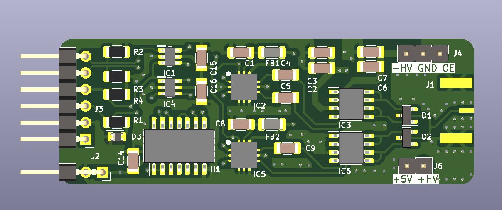
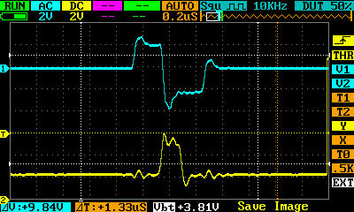
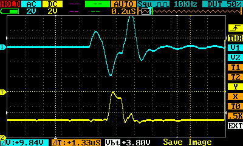
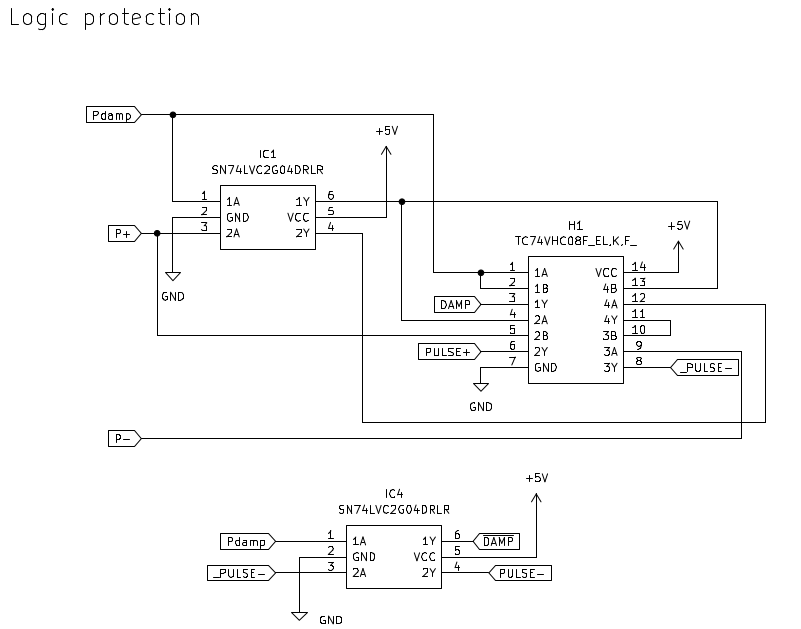
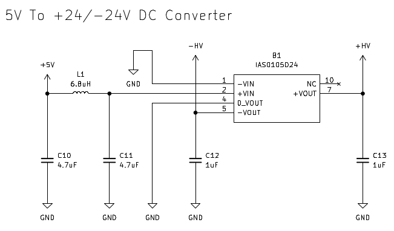

# HV Pulser

* [Schematics](schematics.pdf)

## Pulser

### __Overview__

### Pulser

#### Unloaded, 10x attenuation

#### Loaded, 10x attenuation

### Power use

Tested with rp2040 controlling pulser (in the [firmware](firmware/) folder)

* RPI power: baseline: ~10mA (to be deducted from current below)
* Full power with rp2040, 200us period, 24V: 70/80mA loaded
* Full power with rp2040, 200us period, 24V: 30/60mA unloaded
* rp2040, 200us period, driving 5V pulses: 40/50mA loaded

### __Protection__

## HV Part

